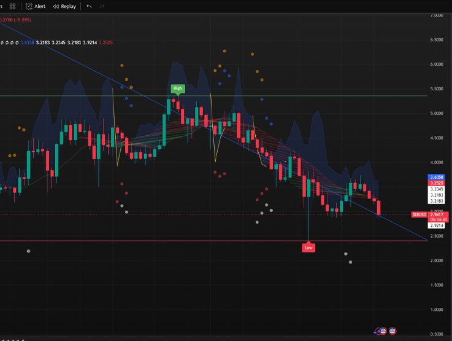
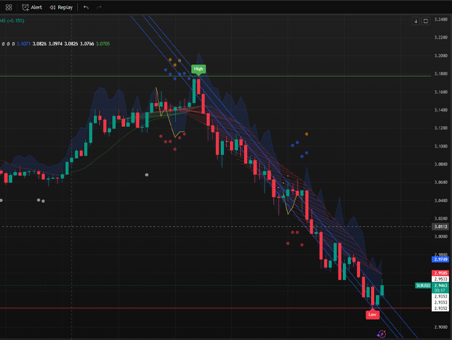

## TradingView Support

 |
--- |
99+ ✔ |

# Korreláció a BTCUSD-hez
## Preview



## Status

[](https://raw.githubusercontent.com/LeBryere/Correlation/master/LICENCE)

# Enhanced RSI Divergence Indicator
## Funkciók:

Ez az indikátor a kiválasztott instrumentum (pl. részvény, devizapár, kriptovaluta) és a Bitcoin (BTCUSD) közötti korrelációt vizsgálja, és többféle vizuális elemmel jeleníti meg az eredményeket. Az indikátor a gyertyák felett és alatt jelenít meg elemeket, ezért érdemes olyan charton használni, ahol van elég hely a gyertyák körül.

### 1. Korreláció számítása (különböző árfolyam-adatokra):
Az indikátor négy különböző korrelációs együtthatót számol a Bitcoin és az aktuális instrumentum között:

- **Open (nyitóár) korreláció:** A Bitcoin nyitóárának és az aktuális instrumentum nyitóárának korrelációja.

- **Close (záróár) korreláció:** A Bitcoin záróárának és az aktuális instrumentum záróárának korrelációja.

- **High (legmagasabb ár) korreláció:** A Bitcoin legmagasabb árfolyamának és az aktuális instrumentum legmagasabb árfolyamának korrelációja.

- **Low (legalacsonyabb ár) korreláció:** A Bitcoin legalacsonyabb árfolyamának és az aktuális instrumentum legalacsonyabb árfolyamának korrelációja.

A korreláció értéke -1 és +1 között mozog. A +1 közeli érték erős pozitív korrelációt jelent (a két instrumentum együtt mozog), a -1 közeli érték erős negatív korrelációt (ellentétesen mozognak), a 0 körüli érték pedig gyenge vagy semmilyen korrelációt.

### 3. Vizuális megjelenítés:

- **Színes körök:** Az indikátor kis, félig átlátszó köröket rajzol a gyertyák felett és alatt, a korreláció előjelétől és típusától függően:

  - **Kék körök** (🔵): A nyitóárak negatív korrelációját jelzik (a gyertyák felett).
  - **Piros körök** (🔴): A záróárak negatív korrelációját jelzik (a gyertyák alatt).
  - **Narancssárga körök** (🟠): A legmagasabb árak negatív korrelációját jelzik (a gyertyák felett).
  - **Fehér körök** (⚪): A legalacsonyabb árak negatív korrelációját jelzik (a gyertyák alatt).

    A körök mérete fix (nagyon kicsi - size.tiny), a pozíciójuk a gyertyákhoz képest pedig az átlagos gyertyamagasság alapján van meghatározva.
    `Fontos:` Csak a negatív korreláció esetén jelennek meg a körök!

- Korrelációs vonal (sárga/kék): Az indikátor egy vonalat is rajzol, ami a záróárak korrelációját mutatja.

  - Ha a záróárak **korrelációja pozitív*, a <span style="color:blue"> vonal kék</span> és a gyertya open szintje felett jelenik meg.
  - Ha a záróárak korrelációja negatív, a <span style="color:yellow">vonal sárga </span>, a gyertya open szintje felett.

- **Kitöltés:** A korrelációs vonal és a gyertya közötti területet kitölti (kékes színnel, különböző átlátszósággal a gyertya testére és kanócaira).

- **SMA vonal:** Az indikátor egy mozgóátlagot (SMA) is rajzol, aminek a színe a záróár és az SMA viszonyától függ (zöld, ha a záróár az SMA felett van, piros, ha alatta).

- **Vízszintes vonalak és pontok (kék, zöld, piros):** Ezek a vonalak és pontok nem kapcsolódnak közvetlenül a korrelációhoz. A kód több, egymástól független funkciót is tartalmaz:
  - **Kék vonal és pontok:** Ezek egy 20 periódusú csúcs-mélypont vonalat és a végpontjain lévő pontokat rajzolják ki. A vonal az utolsó 20 gyertya legmagasabb pontjától az aktuális gyertya legaljáig tart, és mindkét irányban meghosszabbítja (extend.both). A kód maximum két ilyen vonalat tárol.
    ```bash
     newHigh = high == ta.highest(high, 20)
     newLow  = low == ta.lowest(low, 20)
    ```

  - **Zöld és piros vonalak:** Ezek a vonalak a gyertya záróértékének szintjén jelennek meg, zöld, ha az elmúlt 10 gyertya maximuma volt, és piros, ha az elmúlt 10 gyertya minimuma. A vonalak 10 perióduson át húzódnak.

  Jelmagyarázat: A kód egy jelmagyarázatot is megjelenít, ami a színek jelentését magyarázza (High, Open, Close, Low).

### Beállítások (Inputs):
Az indikátornak nincsenek közvetlenül a TradingView felületén (a fogaskerék ikonra kattintva) elérhető beállításai, kivéve az SMA hosszát (length_l). A többi paramétert (pl. a korreláció számításához használt periódust, a színeket) a kódban kell módosítani.

1. *`length_l:`* Az SMA (Simple Moving Average) periódusa (alapértelmezett: 14).
    ```bash
     length_l = input.int(14, title="SMA Hossz")
    ```
### Hogyan használd az indikátort:

1. Másold be a kódot a TradingView Pine Editor-ába.

2. Add hozzá a chartodhoz. Fontos, hogy olyan charton használd, ahol értelme van a BTCUSD-vel való korrelációt vizsgálni (pl. kriptovaluták, vagy olyan részvények, amik erősen korrelálnak a Bitcoinnal).

3. Figyeld meg a köröket és a vonalakat. A körök a negatív korrelációt jelzik (külön a nyitó-, záró-, legmagasabb és legalacsonyabb árakra), a vonal pedig a záróárak korrelációját mutatja (pozitív: kék, a gyertya open felett, negatív: sárga a gyertya open felett).

4. Módosítsd a kódot a saját igényeid szerint. Megváltoztathatod a színeket, a korreláció számításához használt periódust (a length változót a switch szerkezetben), a körök eltolását a gyertyáktól, stb.

## License

<span style="color: red;">Please respect the license terms of any libraries used.</span>

### Korreláció a BTCUSD-hez


## Status

[](https://raw.githubusercontent.com/LeBryere/Correlation/master/LICENCE)
